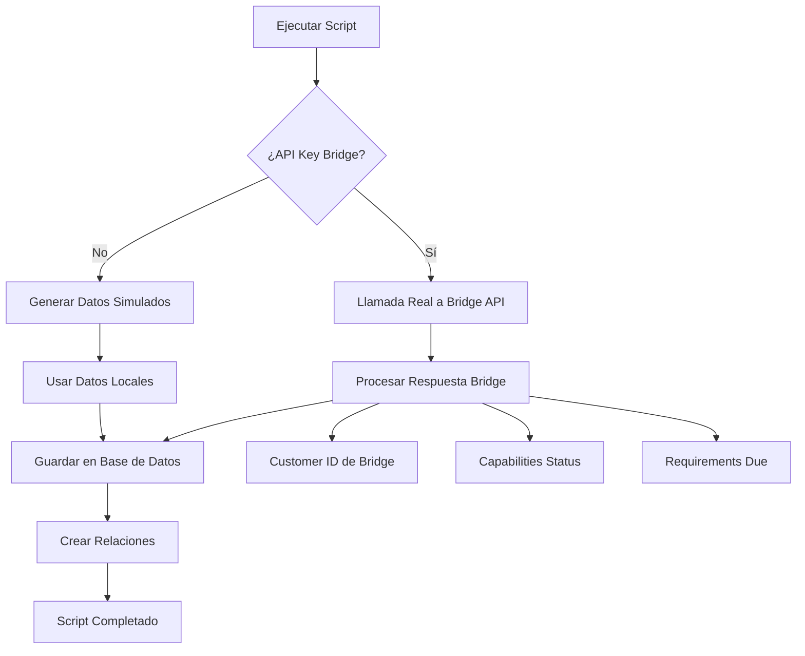

# Scripts de Datos KYC

Scripts para generar y limpiar datos de prueba KYC (Know Your Customer) para el dashboard.

## 🔧 Configuración

### Variables de Entorno Requeridas

```bash
# .env.local
NEXT_PUBLIC_SUPABASE_URL=your_supabase_url
DATABASE_URL=your_database_url

# Opcionales para funcionalidades avanzadas
BRIDGE_API_KEY=your_bridge_api_key           # Opcional - si no se proporciona, usa datos simulados
BRIDGE_API_URL=https://api.sandbox.bridge.xyz/v0  # Por defecto usa sandbox
SUPABASE_SERVICE_KEY=your_service_key        # Opcional - para subir/eliminar imágenes en Storage
```

### Configuración de Variables Opcionales

#### Bridge API (Opcional)
Si tienes acceso al sandbox de Bridge, puedes configurar las variables para hacer llamadas reales:

1. **BRIDGE_API_KEY**: Tu API key del sandbox de Bridge
2. **BRIDGE_API_URL**: URL del API (por defecto usa el sandbox)

Si no configuras estas variables, el script funcionará usando datos simulados que imitan las respuestas de Bridge.

#### Supabase Storage (Opcional)
Para subir y eliminar imágenes reales en Supabase Storage:

1. **SUPABASE_SERVICE_KEY**: Tu service key de Supabase con permisos de Storage

Si no configuras esta variable:
- **Seeding**: Generará URLs válidas de Supabase sin subir archivos reales
- **Limpieza**: Saltará la eliminación de archivos de Storage

## 📦 Instalación

```bash
# Instalar dependencias necesarias
npm install tsx dotenv
```

## 🚀 Scripts Disponibles

### 1. Verificar Configuración

```bash
npm run check:kyc
# o directamente:
npx tsx scripts/check-setup.ts
```

**Qué hace:**

- ✅ Verifica variables de entorno
- ✅ Prueba conexión a base de datos
- ✅ Valida configuración de Bridge API (si está presente)

### 2. Generar Datos de Prueba

```bash
npm run seed:kyc
# o directamente:
npx tsx scripts/seed-kyc-data.ts
```

**Qué hace:**

- 👥 Crea 5 perfiles de prueba con datos realistas mexicanos
- 🔗 **Integración completa**: Hace llamadas reales al Bridge API sandbox
- 📊 Genera datos KYC completos con diferentes estados
- 🏠 Crea direcciones, documentos e información de identificación
- 📱 Guarda IDs de Bridge Customer para integración completa
- 🖼️ **NUEVO**: Sube imágenes reales a Supabase Storage
- 🗄️ **URLs reales**: Guarda URLs públicas de Supabase en la base de datos

**Estados KYC generados:**

- `under_review` - En revisión
- `awaiting_questionnaire` - Esperando cuestionario
- `rejected` - Rechazado (con razones reales de Bridge)
- `incomplete` - Incompleto
- `active` - Aprobado y activo

**Funcionalidades principales:**

- 🔗 **Mapeo automático** Bridge API status → KYC enum local
- 📁 **URLs válidas** de Supabase (NO más mock-url.com)
- 🖼️ **Subida real** de imágenes (cuando hay Service Key)
- 🆔 Generación automática de Idempotency-Key
- 📸 URLs públicas válidas de Supabase Storage
- 🔄 Fallback inteligente a datos simulados si no hay API key
- 📝 Mapeo completo de capabilities, timestamps y estados desde Bridge
- ⚡ Dashboard KYC funcional con visualización de imágenes

### 3. Crear Usuario Existente Verificado

```bash
npx tsx scripts/seed-existing-bridge-user.ts
```

**Qué hace:**

- 🔗 Crea un perfil usando un **Bridge Customer ID existente**
- ✅ Obtiene datos reales del customer desde Bridge API
- 🎯 Perfil **verificado y activo** por defecto
- 📊 Mapea capabilities, endorsements y requirements desde Bridge
- 🖼️ Sube imágenes reales a Supabase Storage
- 🛡️ Detecta si el usuario ya existe en la base de datos

**Bridge Customer ID configurado:**
- `1e97f499-92c3-4cec-a9bb-b0e427a2619f`

**Funcionalidades principales:**

- 🔍 **GET request** a Bridge API para obtener customer existente
- 📈 Estado `active` con capabilities funcionales
- ✅ Endorsements aprobados automáticamente
- 📝 Sin requirements pendientes
- 🎯 Datos perfectos para pruebas de integración

### 4. Limpiar Datos de Prueba

```bash
npm run clean:kyc
# o directamente:
npx tsx scripts/clean-kyc-data.ts
```

**Qué hace:**

- 🗑️ Elimina **TODOS** los perfiles excepto `apps@lednationllc.com`
- 🛡️ Protege automáticamente el perfil principal del sistema
- ⚠️ Muestra advertencias de seguridad con lista de perfiles a eliminar
- 🔗 Limpia datos relacionados (KYC, direcciones, documentos, etc.)
- 📁 **NUEVO**: Elimina automáticamente imágenes de Supabase Storage
- 📊 Muestra resumen de eliminación y perfil protegido

## 📋 Datos Generados

### Perfiles de Prueba

| Email                             | Nombre           | Estado KYC             | Ocupación               | Bridge API | Tipo |
| --------------------------------- | ---------------- | ---------------------- | ----------------------- | ---------- | ---- |
| maria.gonzalez.test@example.com   | María González   | under_review           | Ingeniera de Software   | ✅         | Creado |
| carlos.rodriguez.test@example.com | Carlos Rodríguez | awaiting_questionnaire | Consultor Independiente | ✅         | Creado |
| ana.martinez.test@example.com     | Ana Martínez     | rejected               | Gerente de Marketing    | ✅         | Creado |
| luis.fernandez.test@example.com   | Luis Fernández   | incomplete             | Estudiante de Posgrado  | ✅         | Creado |
| sofia.lopez.test@example.com      | Sofía López      | active                 | Directora de Ventas     | ✅         | Creado |
| juan.vega.verified@example.com    | Juan Carlos Vega | active                 | Director de Tecnología  | ✅         | **Existente** |

### Estructura de Datos

Cada perfil incluye:

**Perfil Base (`profiles`)**

- ✅ Usuario ID único (UUID simulado)
- ✅ Información básica (nombre, email)
- ✅ Estado y rol de usuario

**Perfil KYC (`kyc_profiles`)**

- ✅ **Datos de Bridge**: Customer ID, capabilities, requirements
- ✅ Información personal completa
- ✅ Estado de verificación y timestamps
- ✅ Datos de empleo y propósito de cuenta
- ✅ Configuración de términos y servicios

**Dirección (`addresses`)**

- ✅ Direcciones mexicanas realistas
- ✅ Códigos postales y subdivisiones correctos
- ✅ Formato compatible con Bridge API

**Documentos de Identificación (`identifying_information`)**

- ✅ **Nuevos**: Imágenes base64 mock (frente y reverso)
- ✅ Tipos de documento variados (pasaporte, INE)
- ✅ Números de documento generados
- ✅ Fechas de expiración futuras

**Documentos Adjuntos (`documents`)**

- ✅ **Nuevo**: Archivos base64 mock
- ✅ Comprobantes de domicilio
- ✅ Propósitos de documentos definidos
- ✅ Metadatos de archivos (tamaño, descripción)

**Razones de Rechazo (`rejection_reasons`)**

- ✅ **Integrado**: Razones desde Bridge API cuando aplica
- ✅ Razones de desarrollador detalladas
- ✅ Timestamps de Bridge API

## 🔄 Flujo de Integración Bridge



## 🔐 Seguridad

### Protección de Datos

- ✅ **Perfil protegido**: `apps@lednationllc.com` NUNCA se elimina
- ✅ **Eliminación selectiva**: Solo elimina perfiles no protegidos
- ✅ **Confirmación manual**: Pausa de 5 segundos antes de eliminar
- ✅ **Lista de verificación**: Muestra exactamente qué se eliminará

### Scripts de Seeding

- ✅ **Solo datos de prueba**: Emails con timestamp único
- ✅ **UUIDs simulados**: No se crean usuarios reales en Supabase Auth
- ✅ **Bridge Sandbox**: Solo usa el ambiente de pruebas
- ✅ **Imágenes mock**: Imágenes base64 de 1x1 pixel transparente
- ✅ **Datos mexicanos**: Información geográfica y demográfica realista

## 🐛 Solución de Problemas

### Error de conexión a base de datos

```bash
npm run check:kyc
```

### Bridge API no responde

- ✅ El script continúa con datos simulados
- ✅ Verifica tu `BRIDGE_API_KEY`
- ✅ Confirma que uses el sandbox URL

### Error "most_recent_occupation must be one of..."

- ✅ Bridge requiere códigos específicos para ocupaciones (ej: "132011", "272011")
- ✅ Campo actualmente omitido en el script para evitar errores
- ✅ Referencia: [Bridge occupation codes documentation](https://docs.bridge.xyz/)

### Datos duplicados

```bash
npm run clean:kyc
npm run seed:kyc
```

### Reset completo de datos (mantiene admin)

```bash
# Elimina TODOS los perfiles excepto apps@lednationllc.com
npm run clean:kyc

# Genera nuevos datos de prueba
npm run seed:kyc
```

### Permisos de base de datos

- ✅ Verifica que `DATABASE_URL` tenga permisos de escritura
- ✅ Ejecuta migraciones Prisma si es necesario

## 📚 Ejemplos de Uso

### Desarrollo Local

```bash
# 1. Verificar setup
npm run check:kyc

# 2. Crear datos de prueba
npm run seed:kyc

# 3. Desarrollo y pruebas...

# 4. Limpiar al terminar
npm run clean:kyc
```

### Con Bridge API

```bash
# Configurar .env.local
BRIDGE_API_KEY=your_sandbox_key
BRIDGE_API_URL=https://api.sandbox.bridge.xyz/v0

# Ejecutar con integración real
npm run seed:kyc
```

### Usuario Existente Verificado

```bash
# Crear perfil con Bridge Customer ID existente
npx tsx scripts/seed-existing-bridge-user.ts

# Perfecto para:
# - Pruebas de integración con usuario verificado
# - Testing de funcionalidades que requieren KYC activo
# - Validación de endpoints que necesitan capabilities activas
```

### Solo Datos Locales

```bash
# No configurar BRIDGE_API_KEY

# Ejecutar con datos simulados
npm run seed:kyc
```

## 🔗 Recursos

- [Bridge API Documentation](https://docs.bridge.xyz/)
- [Prisma Schema Reference](./prisma/schema.prisma)
- [KYC Dashboard](/kyc) - Para revisar los datos generados
